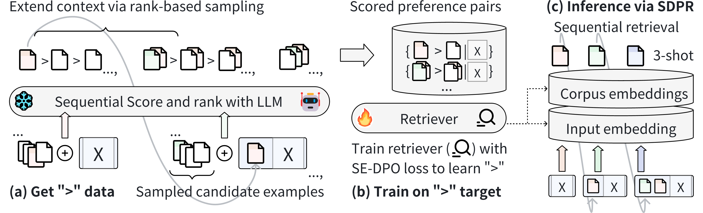

# SeDPO: Learning to Rank for In-Context Example Retrieval

<div id="top" align="center">
<p align="center">

</p>
</div>

> 📝 **Paper**: https://openreview.net/forum?id=WyQ20adbUb<br/>
> 🎞️ **Video**: Coming soon!<br/>
> 🐹 **Poster**: https://neurips.cc/virtual/2025/poster/117557<br/>
> 🐶 **Github**: https://github.com/2022neo/SeDPO_NIPS25<br/>
> ✒️ **Authors**: Yuwen Ji<sup> *</sup>, Luodan Zhang<sup> *</sup>, Ambyer Han<sup> *</sup>, Haoran Que, Lei Shi, Wang Chao, Yue Zhang <sup>†</sup> <br/>
> 📧 **Contact**: {zhangluodan, zhangyue, jiyuwen}@westlake.edu.cn<br/>


## 📢 News!
- **[2025/10/xx]** We released our codes ! 
- **[2025/9/18]** Our paper is accepted by NeurIPS'2025 ! 

## 📄 Introduction

- A novel approach to in-context learning example selection/ordering through the extension of DPO. 
- Experimental results demonstrate the top-1 performance across 4 NLP tasks including 9 subsets, with ablation studies further validating the effectiveness of our design.  
    ```text
    "paraphrase": ["mrpc", "paws", "qqp"],
    "nli": ["mnli-m", mnli-mm],
    "coreference": ["wsc"],
    "reading": ["multirc", "boolq", "ag_news"],
    ```


## ⚙️ Preparation before Start
### Install Dependencies
```bash
cd SeDPO_NIPS25
conda create -n se_dpo python=3.12
conda activate se_dpo
pip install -r requirements.txt
```

### Environment Settings
The default environment settings is:
```bash
export NUM_OF_GPUS=8 # Number of available GPUs for parallel (DDP) training
export RETRIEVER_BSZ=32 # This is per-GPU batch size, and it requires approximately 32*2GB of memory per GPU

# You can ignore the following settings when downloading the scored dataset we provide.
export SCORER_BSZ=10
export SCORE_LLM='EleutherAI/gpt-neo-2.7B'
export INF_LLM='EleutherAI/gpt-neo-2.7B'
# config for huggingface biencoder: `${PWD}/DPR/conf/encoder/hf_bert.yaml`
# we base the retriever on google-bert/bert-base-uncased
```
You can change these environment settings at `./getcmd.sh`. 

### Generate Experiment Scripts
Generate experiment scripts to `./my_data/experiment` by running:
```bash
sh getcmd.sh
```
**Attention!** You must **rerun** this command once environment settings change.

## Quick Start SeDPO 

### Stage 1: Scoring
Download [scored](https://drive.google.com/drive/folders/1yuYXcECdDcX1SeRyG1GkszGiM7qVxrDT?usp=drive_link) and [prompt_pool](https://drive.google.com/drive/folders/1Tiu1BFrfuIktmbPdyztVOi8f8sBwiIoS?usp=drive_link) folders to `./my_data/scored` and `./my_data/prompt_pool` respectively.


**(Not recommended)** Or you can generate `./my_data/scored` and `./my_data/prompt_pool` from scratch by running:
```bash
sh get_score.sh ${task}
# task: paraphrase, reading, nli, coreference

# such as: 
sh get_score.sh paraphrase
```


### Stage 2 & 3: Training & Inference
```bash
sh run_sedpo.sh ${task} ${pref_beta}
# pref_beta: interval([1.0, 0.001])

# such as:
sh run_sedpo.sh paraphrase 0.02
sh run_sedpo.sh coreference 0.1
sh run_sedpo.sh nli 0.02
sh run_sedpo.sh reading 0.1
```
Trained ckpt will be saved to `./my_data/experiment/paraphrase/saves/dp2-r1d0-b0d02`

Inference result will be saved to `./my_data/experiment/paraphrase/eval_res_for_paraphrase.txt`

### Check Logs
Scoring Log will be saved to `my_data/experiment/paraphrase/scorer.log`,

Training Log will be saved to `my_data/experiment/paraphrase/train_dense_encoder.log`.

For a specific task, check Training Log to ensure all subsets are included in "dpr files". For example, paraphrase task consists of 3 subsets ( mrpc, paws, qqp ), the log should be:
```log
[2024-12-15 10:59:25,453][dpr.data.biencoder_data][INFO] - cluster files: ['${PWD}/my_data/scored/paraphrase/*_scored_train.json']
[2024-12-15 10:59:25,455][dpr.data.biencoder_data][INFO] - Toal files num 3
[2024-12-15 10:59:25,455][dpr.data.biencoder_data][INFO] - dpr files: ['${PWD}/my_data/scored/paraphrase/qqp_scored_train.json', '${PWD}/my_data/scored/paraphrase/paws_scored_train.json', '${PWD}/my_data/scored/paraphrase/mrpc_scored_train.json']
```

## Baseline $Se^2$
### Stage 1: Scoring
The same as SeDPO, prepare `./my_data/scored` and `./my_data/prompt_pool` folders.
### Stage 2 & 3: Training & Inference

```bash
sh run_se2.sh ${task}
# task: paraphrase, reading, nli, coreference

# such as:
sh run_se2.sh paraphrase
```
Trained ckpt will be saved to `./my_data/experiment/paraphrase/saves/p0-r1d0`.

Inference result will be saved to `./my_data/experiment/paraphrase/eval_res_for_paraphrase.txt`.

## Main Results

| Method | MRPC (acc) | MRPC (f1) | PAWS (acc) | QQP (acc) | QQP (f1) | Paraphrase Avg. | WSC (acc) |
|--------|------------|-----------|------------|-----------|----------|-----------------|-----------|
| Zeroshot | 46.1±0.0 | 45.3±0.0 | 51.8±0.0 | 48.4±0.0 | 42.1±0.0 | 46.7±0.0 | 59.6±0.0 |
| Random | 66.8±3.0 | 79.5±4.1 | 50.1±3.8 | 40.6±4.8 | 50.9±7.8 | 57.6±3.8 | 48.3±8.2 |
| BM25 | 57.8±0.0 | 69.1±0.0 | 48.9±0.0 | 54.8±0.0 | 55.4±0.0 | 57.2±0.0 | 52.4±0.0 |
| SBERT | 56.4±0.0 | 66.9±0.0 | 49.4±0.0 | 51.2±0.0 | 56.2±0.0 | 56.0±0.0 | 46.2±0.0 |
| UDR | 65.9±4.6 | 75.4±3.5 | 51.8±1.2 | 74.1±1.9 | 67.9±2.4 | 67.0±1.2 | 52.0±4.7 |
| UPRISE | 74.0±0.8 | 83.3±0.1 | 49.1±0.0 | 71.0±1.0 | 69.8±0.1 | 69.4±0.2 | 46.5±2.2 |
| Se² | 77.6±0.4 | 85.4±0.3 | 54.7±0.1 | 75.5±0.1 | 72.8±0.0 | 73.2±0.2 | 55.1±0.9 |
| **SeDPO** | **77.9±0.9** | **85.6±0.2** | **73.0±2.9** | **77.6±0.6** | **75.0±0.2** | **77.9±0.6** | **62.5±0.2** |

| Method | MultiRC (f1) | BoolQ (acc) | AGNews (acc) | Reading Avg. | MNLI-m (acc) | MNLI-mm (acc) | NLI Avg. |
|--------|--------------|-------------|--------------|--------------|--------------|---------------|----------|
| Zeroshot | 57.1±0.0 | 54.6±0.0 | 38.4±0.0 | 50.0±0.0 | 35.2±0.0 | 36.4±0.0 | 35.8±0.0 |
| Random | 57.7±2.5 | 54.8±6.7 | 25.8±1.1 | 46.1±1.2 | 34.2±3.0 | 34.9±3.9 | 34.6±1.6 |
| BM25 | 46.5±0.0 | 60.3±0.0 | 81.7±0.0 | 62.8±0.0 | 35.3±0.0 | 35.6±0.0 | 35.5±0.0 |
| SBERT | 49.3±0.0 | 58.1±0.0 | 84.7±0.0 | 64.0±0.0 | 37.3±0.0 | 37.3±0.0 | 37.3±0.0 |
| UDR | 55.3±3.1 | 54.6±1.9 | 88.5±1.0 | 66.1±0.9 | 62.7±1.5 | 65.0±1.3 | 63.8±1.4 |
| UPRISE | 55.4±0.2 | 61.5±0.1 | 90.6±0.8 | 69.2±0.1 | 68.5±0.1 | 70.3±0.3 | 69.4±0.2 |
| Se² | 47.1±3.3 | 64.1±2.2 | 90.7±0.3 | 67.3±0.7 | 69.4±0.2 | 70.4±0.1 | 69.9±0.2 |
| **SeDPO** | **61.6±0.4** | **66.2±1.7** | **90.7±0.2** | **72.8±0.6** | **70.6±0.1** | **72.0±0.3** | **71.3±0.2** |

## Ablation Study
- Finetune trained SeDPO using $Se^2$.
    ```bash
    sh run_sedpo_se2.sh ${task} ${sedpo_model}

    # such as:
    sh run_sedpo_se2.sh paraphrase my_data/experiment/paraphrase/saves/dp2-r1d0-b0d02/dpr_biencoder.best_valid
    ```
    Inference result will be saved to `./my_data/experiment/paraphrase/eval_res_for_paraphrase.txt`

- Finetune trained $Se^2$ using SeDPO.
    ```bash
    sh run_se2_sedpo.sh ${task} ${se2_model} ${pref_beta}
    # pref_beta: interval([1.0, 0.001])

    # such as:
    sh run_se2_sedpo.sh paraphrase my_data/experiment/paraphrase/saves/p0-r1d0/dpr_biencoder.best_valid 0.02
    ```
    Inference result will be saved to `./my_data/experiment/paraphrase/eval_res_for_paraphrase.txt`

## Enhance SeDPO with RoBERTa
Change the setting in `./DPR/conf/encoder/hf_bert.yaml` as follows:

```bash
# encoder_model_type: hf_bert
# pretrained_model_cfg: google-bert/bert-base-uncased
# pretrained_file:

# download roberta from its offical sources
encoder_model_type: fairseq_roberta
pretrained_model_cfg: ${PWD}/cache/FacebookAI/roberta-base
pretrained_file: ${PWD}/cache/roberta.base
```


## Citation

Our code is largely borrowed from [*Se²*](https://github.com/microsoft/LMOps/tree/main/se2) and [DPR](https://github.com/facebookresearch/DPR). Thanks for their awesome codebases. If you find our code or models useful in your work, please cite our paper.
```bibtex
@inproceedings{
anonymous2025learning,
title={Learning to Rank for In-Context Example Retrieval},
author={Anonymous},
booktitle={The Thirty-ninth Annual Conference on Neural Information Processing Systems},
year={2025},
url={https://openreview.net/forum?id=WyQ20adbUb}
}
```
